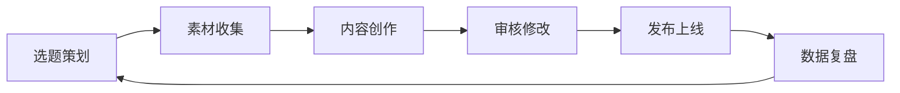

---
tags:
  - 内容管理
  - 系统
  - CMS
cssclasses:
created: 2026-06-12
---

# 📺 内容管理系统 - My Channel

## 🎯 频道定位

**频道主题：** 从阿里到国企 - 真实职场转型故事

**目标受众：**
- 互联网从业者考虑职业转型
- 对国企/体制内工作感兴趣的人群
- 职场新人探索职业路径

**内容风格：**
- 真实、接地气的个人经历
- 对比互联网与国企的差异
- 引发共鸣的职场思考

---

## 📊 内容矩阵

### 内容类型

| 类型 | 说明 | 占比 | 状态 |
|------|------|------|------|
| 🎬 短视频/图文 | 小红书、抖音、视频号 | 60% | ✅ 已有内容 |
| 📝 长文 | 公众号、知乎专栏 | 25% | 🔄 待开发 |
| 🎙️ 播客/音频 | 音频分享 | 10% | ⏳ 规划中 |
| 📚 电子书/合集 | 深度内容合集 | 5% | ⏳ 规划中 |

---

## 📁 文件夹结构

```
my-channel/
├── 内容管理系统.md          # 本文件 - 管理中枢
├── 01-已发布/              # 已发布的内容
├── 02-创作中/              # 正在创作的内容
├── 03-素材库/              # 素材和灵感
├── 04-模板/                # 内容模板
├── 05-数据复盘/            # 发布数据和复盘
└── 06-选题库/              # 待创作的选题
```

---

## 📋 内容清单

### 已完成内容（来自 target）

| 序号 | 标题 | 日期 | 状态 | 链接 |
|------|------|------|------|------|
| 1 | 从阿里到国企，入职第一天同事说我太焦虑了 | 2026-05-30 | ✅ 已完成 | [[07-talk/target/my-channel/01-已发布/2026-05-30-从阿里到国企，入职第一天同事说我太焦虑了]] |
| 2 | 从阿里到国企，我洗澡的时候不再想工作了 | 2026-06-03 | ✅ 已完成 | [[2026-06-03-从阿里到国企，我洗澡的时候不再想工作了]] |
| 3 | 从阿里到国企，光彩奕奕的P7，变成没前途的大头兵 | 2026-06-06 | ✅ 已完成 | [[2026-06-06-从阿里到国企，光彩奕奕的P7，变成没前途的大头兵]] |
| 4 | 从阿里到国企，稳定工作，真的会让你快乐么 | 2026-06-06 | ✅ 已完成 | [[2026-06-06-从阿里到国企，稳定工作，真的会让你快乐么]] |
| 5 | 从阿里到国企，开保时捷的房东，想明白了生活 | 2026-06-11 | ✅ 已完成 | [[2026-06-11-从阿里到国企，开保时捷的房东，想明白了生活]] |

---

## 🏷️ 标签体系

### 内容标签
- #互联网 #国企 #职业转型
- #阿里 #职场 #生活感悟
- #工作生活平衡 #价值观

### 状态标签
- #已发布 #创作中 #待修改 #已归档

### 平台标签
- #小红书 #公众号 #抖音 #视频号

---

## 📅 发布计划

### 内容节奏
- **更新频率：** 每周 2-3 篇
- **最佳发布时间：** 
  - 小红书：晚上 8-10 点
  - 公众号：早上 8-9 点
  - 抖音：晚上 7-9 点

### 内容规划
- **系列主题：** "从阿里到国企"系列（已完成5篇）
- **扩展方向：**
  - 国企日常
  - 职场对比
  - 生活方式变化
  - 给转型者的建议

---

## 📈 数据指标

### 关注指标
- 浏览量/播放量
- 点赞/收藏/分享
- 评论互动
- 粉丝增长

### 复盘周期
- **日复盘：** 单篇内容数据
- **周复盘：** 一周内容表现
- **月复盘：** 整体增长趋势

---

## 🔧 工作流

### 内容创作流程



### 状态说明
- ⏳ 待开始
- 🔄 进行中
- ✅ 已完成
- ❌ 已取消

---

## 💡 快速操作

### 创建新内容
1. 在 `04-模板/` 中选择合适模板
2. 复制到 `02-创作中/`
3. 完成后移动到 `01-已发布/`

### 记录灵感
1. 在 `03-素材库/` 创建灵感笔记
2. 添加标签和日期
3. 定期整理到 `06-选题库/`

### 数据复盘
1. 在 `05-数据复盘/` 创建复盘笔记
2. 记录数据和分析
3. 总结经验教训

---

## 📚 相关资源

- [[06-Templates/目标达成模板]] - 每日目标管理
- [[05-Area/心理学/]] - 用户心理洞察
- [[05-Area/奥派经济学/]] - 商业思维

---

**系统版本：** v1.0  
**创建日期：** 2026-06-12  
**维护者：** {{owner}}
